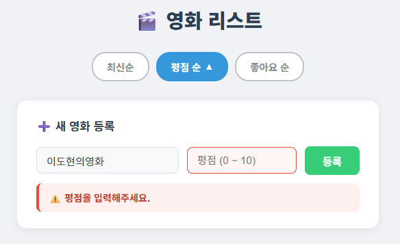
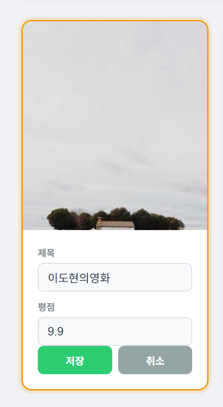
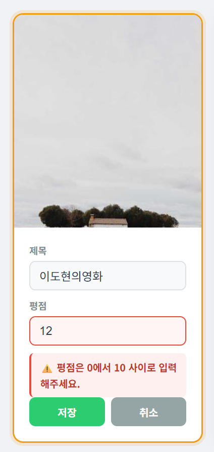

# 🎬 Week 8 Mission — 영화 애플리케이션

> Vue 3 기반 영화 리스트 애플리케이션  
> 7주차(Props & Emit) 코드를 기반으로 추가 기능 3가지를 모두 구현하였습니다.

---

## 🛠 기술 스택

| 항목 | 내용 |
|------|------|
| 프레임워크 | Vue 3 (Composition API / `<script setup>`) |
| 빌드 도구 | Vite |
| 상태 관리 | `ref`, `computed` |
| 컴포넌트 통신 | Props & Emit |

---

## 🚀 실행 방법

```bash
npm install
npm run dev
```

---

## 📁 프로젝트 구조

```
src/
├── App.vue                  # 루트 컴포넌트 (상태 관리 및 이벤트 핸들링)
└── components/
    ├── MovieCard.vue        # 영화 카드 (뷰 모드 / 수정 모드)
    └── AddMovieForm.vue     # 신규 영화 등록 폼
```

---

## ✅ 선택한 미션 옵션

> **옵션 A + B + C 전부 구현**

---

## 📌 구현 기능 상세

### 옵션 A — 동적 데이터 정렬 및 UI 피드백

**요구사항:** 정렬 버튼 구현 + 활성 버튼 시각적 강조

**구현 내용:**
- 페이지 로드 시 **최신순(▼)** 이 기본 정렬로 활성화
- `최신순` / `평점 순` / `좋아요 순` 버튼 3개 제공
- 활성 버튼: 파란색 배경으로 강조 표시
- **같은 버튼 재클릭** 시 내림차순(▼) ↔ 오름차순(▲) 토글
- 다른 버튼 클릭 시 해당 기준으로 전환되고 방향은 내림차순으로 초기화
- `computed`를 활용해 원본 배열을 훼손하지 않고 정렬된 배열을 별도 반환

> **📸 스크린샷**
>
> | 기본 상태 (최신순 ▼ 활성) | 평점 순 ▲ 오름차순 전환 |
> |---|---|
> |  |  |

---

### 옵션 B — 신규 영화 등록 폼 컴포넌트

**요구사항:** `AddMovieForm.vue` 자식 컴포넌트로 영화 추가 + 빈값 방어 로직

**구현 내용:**
- `AddMovieForm.vue` 컴포넌트 분리 (제목 입력 + 평점 입력 + 등록 버튼)
- `emit('add-movie', { title, rating })` 으로 부모 원본 배열에 추가
- **방어 로직 (브라우저 alert 없이 인라인 에러 처리):**
  - 제목 미입력 → 제목 input 빨간 테두리 + 에러 메시지 표시
  - 평점 미입력 / NaN → 평점 input 빨간 테두리 + 에러 메시지 표시
  - 평점 범위(0~10) 초과 → 에러 메시지 표시
  - 에러 메시지는 3초 후 자동으로 사라짐 (fade 애니메이션)
- **등록 성공 시** 초록색 성공 메시지 2.5초 표시 후 자동 소멸
- 등록 후 입력 필드 자동 초기화

> **📸 스크린샷**
>
> | 에러 상태 (빈값 등록 시도) | 등록 성공 피드백 |
> |---|---|
> |  |  |

---

### 옵션 C — 개별 영화 정보 수정(Edit) 기능

**요구사항:** 영화 카드 내 [수정] 버튼 → input 전환 → [저장] 시 부모 데이터 갱신

**구현 내용:**
- 각 영화 카드에 [수정] 버튼 추가
- 클릭 시 제목·평점이 `<input>`으로 전환 (뷰 모드 ↔ 수정 모드 `v-if/v-else`)
- 수정 모드 진입 시 카드에 **주황색 테두리 + 그림자** 로 시각적 강조
- 수정 모드에서는 카드 hover 효과 비활성화
- **방어 로직:**
  - 제목 미입력 → input 빨간 테두리 + 인라인 에러 메시지
  - 평점 미입력 / NaN / 범위 초과 → 에러 메시지 표시
  - 에러 메시지 3초 후 자동 소멸
- [저장] 클릭 시 `emit('update-movie', { id, title, rating })` → 부모가 원본 배열 갱신
- [취소] 클릭 시 변경사항 없이 뷰 모드로 복귀

> **📸 스크린샷**
>
> | 뷰 모드 (기본) | 수정 모드 활성화 | 수정 에러 상태 |
> |---|---|---|
> |  |  |  |

---

## 🗂 컴포넌트 역할 분리

```
App.vue
 ├── 영화 데이터(movies) 원본 배열 관리 — Source of Truth
 ├── 정렬 상태(sortBy, sortDir) 관리
 ├── handleLike / handleDelete / handleAdd / handleUpdate 처리
 │
 ├── <AddMovieForm>  ──emit('add-movie')──▶  handleAdd()
 └── <MovieCard>     ──emit('like-movie')──▶  handleLike()
                     ──emit('delete-movie')─▶  handleDelete()
                     ──emit('update-movie')─▶  handleUpdate()
```

---

## 💡 주요 Vue 개념 적용

| 개념 | 적용 위치 |
|------|-----------|
| `ref` | 영화 배열, 정렬 상태, 편집 상태, 에러 메시지 등 |
| `computed` | `sortedMovies` — 원본 훼손 없이 정렬된 배열 반환 |
| `v-for` + `:key` | 영화 카드 렌더링 (`:key="m.id"`), 정렬 버튼 렌더링 (`:key="opt.key"`) |
| `v-model` / `v-model.number` | 폼 입력값 바인딩 |
| `v-if` / `v-else` | 뷰 모드 ↔ 수정 모드 전환, 에러·성공 메시지 표시 |
| 동적 클래스 `:class` | 정렬 버튼 활성화, 에러 input 강조, 수정 중 카드 강조 |
| Props & Emit | 부모↔자식 데이터·이벤트 통신 |
| `<transition>` | 에러·성공 메시지 fade/slide 애니메이션 |
